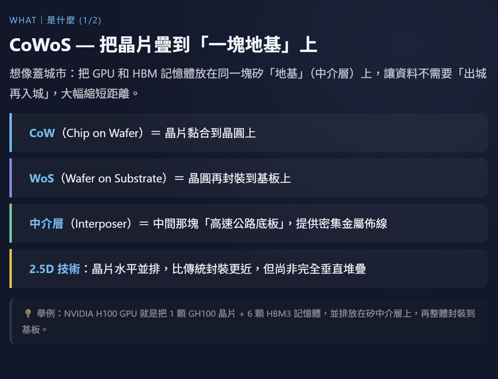

## CoWoS（Chip-on-Wafer-on-Substrate）全球分析報告

https://www.perplexity.ai/search/cowos-soic-feng-zhuang-zhi-che-9dk.4Gr6TQu5gGMFnmID3Q?preview=1

**報告生成日期：** 2026 年 04 月 07 日  
**數據主要覆蓋期間：** 2024 年 Q1 – 2026 年 Q1

---

## ⚡ 最新動態摘要（近 6 個月重大事件）

> - **2026-02：** 法人上修台積電 CoWoS 產能預期，預估 2026 年底達 140kwpm，以支援 2027 Q1 需求；2027 年底嘉義 AP7 及台南 AP8 全面達產後，總產能將達 170kwpm[money.udn](https://money.udn.com/money/story/5607/9343218)
>     
> 
> - **2026-01：** 台積電 CoWoS 產能規劃 2026 年底擴至每月 11.5–12.5 萬片，並計畫將既有 8 吋廠轉型為先進封裝廠[businessweekly.com](businessweekly.com)
>     
> 
> - **2025-11：** Aletheia 資本報告揭示，2026 年 CoWoS 產能缺口高達 40 萬片、2027 年達 70 萬片，供不應求態勢嚴峻[news.yahoo](news.yahoo)
>     
> 
> - **2025-09：** 台積電 CoWoS 技術路線分化加速，CoWoS-L（局部矽中介層）年增幅達 470%，成為新主力產品線，逐步取代傳統 CoWoS-S[bnext](https://www.bnext.com.tw/article/82088/tsmc-cowos-type-explanation)
>     
> 
> - **2025-07：** 摩根士丹利報告預測 2026 年全球 CoWoS 晶圓總需求達 100 萬片，NVIDIA 獨佔約 59.5 萬片（約 60%），AMD、博通、亞馬遜等激烈角逐剩餘產能[wallstreetcn](https://wallstreetcn.com/articles/3752125)
>     

---

## 一、主要用途分佈（需求方）

|排序|用途名稱|全球需求佔比|典型應用場景|近期需求趨勢|來源層級|
|---|---|---|---|---|---|
|1|AI 加速器 / GPU 封裝|~60%（2026年預測）|NVIDIA Rubin、Blackwell、GB10；AMD MI300 系列等高算力 GPU，主要用於 AI 訓練與推理|🔺 強勁成長：2025–2027 年需求暴增 8–10 倍，NVIDIA 單家客戶即佔全球 CoWoS 需求約 60%|P3/P4 wallstreetcn+1|
|2|雲端 AI 加速晶片 / CSP 自研芯片|~20%（2025–2026年）|亞馬遜 Trainium/Inferentia、Google TPU、微軟 Maia 等雲端服務商（CSP）自研 AI 晶片|🔺 快速成長：CSP 自研晶片比重持續提升，2026 年搶佔 CoWoS 產能比例顯著擴大|P3/P4 wallstreetcn+1|
|3|網路交換器 / 高速通訊晶片|~10%（2025年）|博通 Tomahawk 6、CPX 系列網路交換器；用於資料中心高速互聯|🔺 成長：AI 資料中心網路頻寬需求爆發，2026 年博通 CoWoS 訂單顯著提升|P4 [news.yahoo](news.yahoo)|
|4|伺服器 CPU / 高效能計算|~5%（2025–2026年）|AMD Zen6 伺服器 CPU、NVIDIA Vera CPU；HPC 工作站應用|🔺 新興成長：2025 下半年開始採用 CoWoS 架構，2026 年加速導入|P4 [news.yahoo](news.yahoo)|
|5|消費性電子 / 遊戲主機|~5%（2025–2026年）|微軟 Xbox APU、高端 PC 繪圖晶片；遊戲主機次世代晶片|🔺 新應用：2026 年開始大規模導入，為 CoWoS 開拓消費端新市場|P4 [news.yahoo](news.yahoo)|

---

## 二、全球產能分佈（供應方）

|排序|公司名稱|全球產能佔比|主要生產地區|具體生產特徵（含近期動態）|來源層級|
|---|---|---|---|---|---|
|1|**台積電 TSMC**|~85–90%（2025年估算）|台灣（台中、台南、嘉義為主）；規劃美國亞利桑那州設點|掌握 CoWoS-S（矽中介層）及 CoWoS-L（局部矽中介層）兩大技術路線；CoWoS-L 為 2025–2026 年主力成長產品線，年增幅達 470%。**【最新】** 2024 年底月產能約 3.2–3.5 萬片 → 2025 年翻倍至約 7 萬片 → 2026 年底目標 12.5–14 萬片。嘉義 AP7 與台南 AP8 兩大先進封裝廠 2027 年達全面運作，總產能目標 170kwpm。2022–2026 年 CAGR 預估超過 50%。|P3/P4 growin+3|
|2|**日月光投控 ASE**|~5–8%（2025年估算，擴產中）|台灣（高雄、中壢）；馬來西亞、中國大陸（上海、昆山）|提供 CoWoS 前段製程外包服務，定位為台積電最重要的協力封裝夥伴。**【最新】** 2026 年 CoWoS 產能目標倍增，積極爭取博通、NVIDIA Vera CPU、亞馬遜前段訂單；AMD 亦已確認將旗下所有新產品（AI GPU、伺服器 CPU、高端 PC、Xbox CPU）封裝業務轉向 ASE。|P4 [news.yahoo](news.yahoo)+1|
|3|**Amkor Technology（艾克爾）**|~3–5%（2025年估算）|韓國（仁川）；越南（河內）；美國（亞利桑那州 Peoria 新廠）|承接 NVIDIA Vera CPU 的部分 CoWoS 封裝分工；定位補充台積電產能缺口的第二供應來源。**【最新】** NVIDIA 在台積電之外另採購約 8 萬片/年來自 Amkor 等非台積電供應商（2026 年預測）；美國亞利桑那新廠 2024 年已部分投產，強化在地供應能力。|P4 wallstreetcn+1|
|4|**三星電子 Samsung**|~2–3%（2025年，⚠️ 數據偏舊，主要來自 2023 年）|韓國（平澤、華城）；美國德州（泰勒新廠規劃中）|以 I-Cube 技術（對應 CoWoS-S）為主，主攻自有 HBM+GPU 整合封裝；目前技術成熟度及良率相較台積電仍有差距，主要服務自有生態系客戶。⚠️ 最新市佔率數據待 2025 年財報確認。|P4/P5 [ltn](https://ec.ltn.com.tw/article/breakingnews/5074028)|
|5|**Intel Foundry Services（IFS）**|<1%（2025年，初期導入階段）|美國（亞利桑那州 Chandler）；愛爾蘭（Leixlip）|以 EMIB（嵌入式多晶片互連橋接）為主要先進封裝技術，提供類似 CoWoS-S 的異構整合能力，但目前 CoWoS 相容服務規模極小。資料待補充（尚無已確認大型外部 CoWoS 訂單）。|P4|

---

## 三、供需驅動因素分析

## 3A. 供應端驅動因素

|排序|驅動因素名稱|影響方向|影響強度|時間維度|具體說明（含 2024 年後事件）|
|---|---|---|---|---|---|
|1|台積電產能瓶頸與資本支出週期|↑（擴產利多）/ 短期仍↓（瓶頸）|H|短S＋中M|台積電是全球唯一大規模量產 CoWoS 的供應商，獨佔約 85–90% 產能，形成高度單一供應風險。2024–2026 年台積電 CoWoS 資本支出大幅提升，但建廠週期長達 18–24 個月，導致 2025–2026 年持續供不應求。Aletheia 資本 2025 年 11 月報告確認 2026 年缺口達 40 萬片。 [news.yahoo](news.yahoo)|
|2|矽中介層（Silicon Interposer）材料及 HBM 供應鏈限制|↓（制約供給）|H|短S＋中M|CoWoS 製程需整合 HBM（高頻寬記憶體）及大尺寸矽中介層，兩者供應均為瓶頸。HBM 主要由 SK 海力士、三星、美光供應，2024–2025 年 HBM3E 需求遠超產能。CoWoS-L 的局部矽中介層雖緩解部分成本，但製程複雜度更高，良率爬坡需時。 fugle+1|
|3|地緣政治風險與供應鏈集中度|↓（潛在負向衝擊）|H|短S＋中M|CoWoS 產能高度集中於台灣（>85%），地緣政治風險形成供應鏈脆弱性。美國政府積極推動半導體在地化，促使台積電加速美國亞利桑那先進封裝廠布局（2025 年 6 月第三期晶圓廠動土，下一步導入 CoWoS）。2025 年美國對台灣晶片生產的依賴度引發政策關注。 [ltn](https://ec.ltn.com.tw/article/breakingnews/5074028)|
|4|先進封裝技術路線演進（CoWoS-S → CoWoS-L → CoPoS）|↑（長期產能彈性提升）|M|中M＋長L|CoWoS-L 較 CoWoS-S 可支援更大晶片面積（解決 reticle 尺寸限制），2025–2026 年成為主力產品線，年增 470%。技術路線升級同時帶來良率爬坡挑戰，短期可能限制有效供給量。CoPoS（面板級封裝）為下一代技術，預計 2027 年以後才能大規模量產。 fugle+1|
|5|封測廠（OSAT）產能外溢效應|↑（補充供給）|M|短S＋中M|ASE、Amkor 等 OSAT 廠承接台積電 CoWoS 外溢訂單，2026 年 ASE CoWoS 產能目標倍增。台積電主動攜手封測合作夥伴，目標 2025–2026 年共同達到供需平衡。NVIDIA Vera、AMD 新品均已確認分散至 ASE、Amkor 封裝。 [news.yahoo](news.yahoo)+1|

## 3B. 需求端驅動因素

|排序|驅動因素名稱|影響方向|影響強度|時間維度|具體說明（含 2024 年後事件）|
|---|---|---|---|---|---|
|1|AI 算力軍備競賽驅動 GPU 超級訂單|↑|H|短S＋中M|NVIDIA 一家即佔 2026 年全球 CoWoS 需求約 60%（59.5 萬片），2025–2027 年需求暴增 8–10 倍。驅動因素包含 Blackwell/Rubin 世代 GPU 換代、AI 資料中心投資加速。2025 年美國科技巨頭資本支出（Meta、Google、Microsoft、Amazon）合計超過 3,000 億美元，AI 伺服器為最大支出項目。 wallstreetcn+1|
|2|CSP 自研晶片快速崛起擴大 CoWoS 客戶基礎|↑|H|短S＋中M|Google、Amazon、Microsoft、Meta 等雲端服務商加速自研 AI 晶片，均選用台積電 CoWoS 封裝技術，使需求來源從 NVIDIA 一超擴散為多極需求。Amazon Trainium 3、Google TPU v6 等均採 CoWoS 封裝，2026 年 CSP 客戶佔 CoWoS 需求比重持續攀升。 [wallstreetcn](https://wallstreetcn.com/articles/3752125)|
|3|CoWoS 應用版圖擴張（非 AI GPU 新應用）|↑|M|短S＋中M|2025 下半年起，伺服器 CPU（AMD Zen6、NVIDIA Vera）、高端 PC 繪圖晶片、微軟 Xbox APU、博通網路交換器（Tomahawk 6）開始採用 CoWoS 架構，使需求來源多元化。Aletheia 資本 2025 年 11 月報告指出，此類非傳統 AI 新應用 CoWoS 需求「被市場嚴重低估」。 [news.yahoo](news.yahoo)|
|4|摩爾定律放緩迫使先進封裝成剛需|↑|H|中M＋長L|晶片製程微縮趨近物理極限，先進封裝成為延伸摩爾定律的核心手段。CoWoS 可將不同製程節點晶片（如 3nm GPU + 12nm 射頻）整合於同一封裝，兼顧效能與成本控制。台積電 2022–2026 年 CoWoS CAGR 預估逾 50%，顯示結構性長期需求。 growin+1|
|5|美國 AI 出口管制對需求地域分配的影響|↔（區域重分配）|M|短S＋中M|美國政府針對中國的 AI 晶片出口管制持續收緊（2024 年 H100 擴大管制、2025 年新規），導致中國科技廠商 CoWoS 需求受限，但推動美國及盟友 AI 建設投資加速，整體全球需求未見明顯萎縮。需求從中國轉向美國、歐洲、中東等地區。 [ltn](https://ec.ltn.com.tw/article/breakingnews/5074028)|

## 3C. 供需平衡展望摘要

> 綜合以上驅動因素，預期 CoWoS 在 **2026–2027 年內呈現顯著供需緊張**態勢。  
> Aletheia 資本預估 2026 年缺口達 40 萬片、2027 年擴大至 70 萬片，即使台積電全力擴產仍難以補足缺口。  
> 主要風險來自**台積電產能瓶頸與建廠週期**（供應端最高影響）及 **AI 算力超大訂單集中度**（需求端最高影響）。  
> 關鍵監測指標包含：**①台積電 CoWoS 月產能達標進度（目標 2026 年底 12.5–14 萬片）**、**② NVIDIA/AMD/CSP 客戶季度 CoWoS 訂單量及交貨週期**、**③ HBM3E/HBM4 供應鏈交付節奏**。

---

## 補充說明

**資料來源清單：**

|來源層級|資料來源名稱|數據截止日期|涵蓋範圍|
|---|---|---|---|
|P3|摩根士丹利（Morgan Stanley）CoWoS 供應鏈調查報告|2025年Q3（2025-07-28）|全球 CoWoS 需求量預測、客戶分配比例、台積電產能預估|
|P3|IDC「2025 年全球半導體市場八大趨勢預測」|2024年Q4（2024-12）|台積電 CoWoS 年度產能預測（2024–2025）|
|P3|Aletheia 資本「看 AI 機運」報告|2025年Q4（2025-11）|2026–2027 年 CoWoS 供需缺口分析、受惠供應鏈廠商|
|P4|商業周刊、數位時代、科技新報等台灣財經媒體|2025年Q3–2026年Q1|台積電擴產動態、供應鏈廠商動向、技術路線說明|
|P4|經濟日報、富途資訊等財經媒體|2026年Q1|法人預估台積電產能目標與 AI 收入占比|

**數據缺口清單（⚠️）：**

|缺口項目|最新可用數據年份|缺口原因|建議補充方式|
|---|---|---|---|
|三星 CoWoS 精確市佔率|2023年|三星未單獨揭露先進封裝細項產能；外部研究覆蓋度低|查閱三星 2024/2025 年報 Foundry 業務分部資料|
|Intel IFS CoWoS 訂單規模|⚠️ 最新數據不可得|Intel Foundry CoWoS 相容服務尚未獲重大外部訂單，公開資料極少|追蹤 Intel IFS 官方產品發布及法說會說明|
|各用途需求佔比精確量化|2025年Q3（估算）|全球 CoWoS 用途分拆數據多為投行估算，非官方統計|參照 SEMI、Yole Développement 等專業機構最新報告|
|ASE / Amkor CoWoS 精確產能數字|2025年Q4（估算）|兩家公司未單獨揭露 CoWoS 產能，僅有擴產方向性說明|查閱 ASE 2025 全年法說會及 Amkor 2024 年報|

**備註：**

- 本報告 CoWoS 定義聚焦台積電 CoWoS-S 及 CoWoS-L 兩大商業量產技術路線，CoPoS（面板級封裝）及 CoWoP 等次世代技術因尚未大規模量產，未納入產能統計主體。
    

- 台積電全球產能占比採用多家投行估算綜合推算（~85–90%），非官方公開數字，建議以台積電法說會最新揭露數據為最終參考基準。
    

- 需求佔比數據（用途分析表）主要來源為摩根士丹利 2025 年 7 月報告之訂單估算，與實際出貨量可能存在差異；用途佔比排序邏輯與數量級方向可信，精確百分比需待 2025 年全年出貨數據公布後驗證。news.futunn+1
    

---