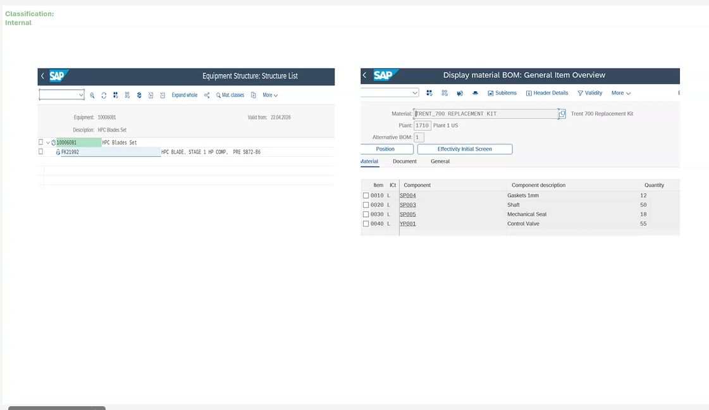
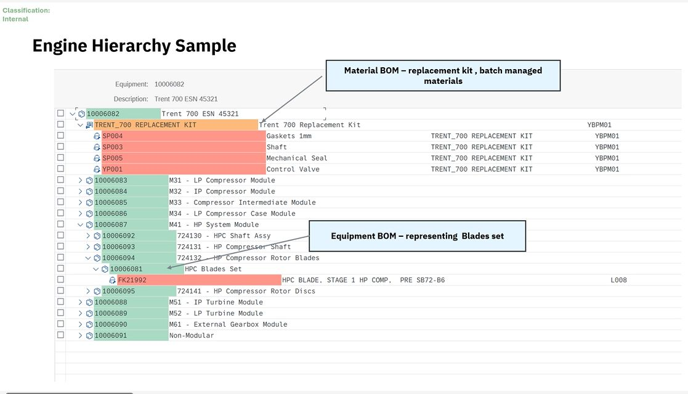
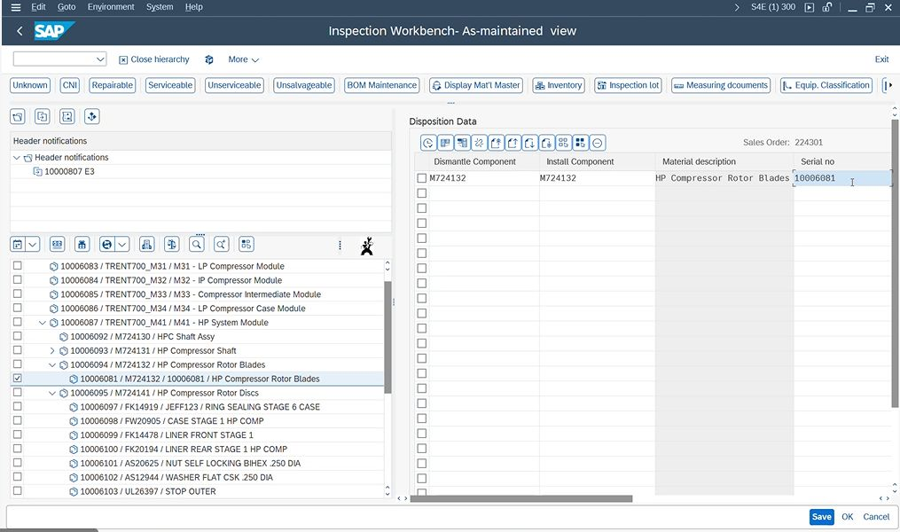
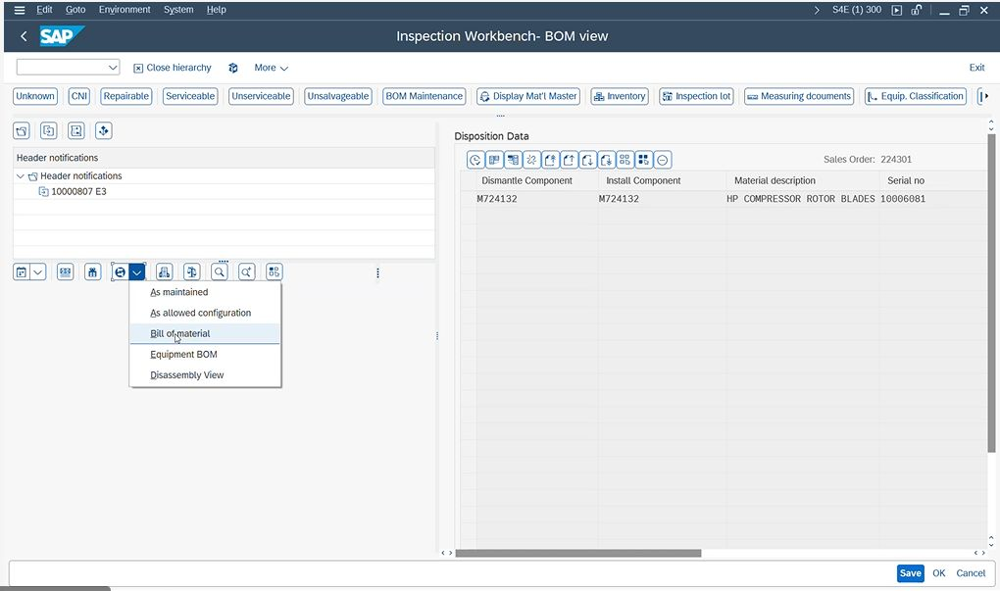

TRENT_700_Replacement_kit is created in advance
- whether it is created from the sentencing team (query from Paul)?

how to identify the difference between equipment and  BOM? No but can be customized

---
PM session

