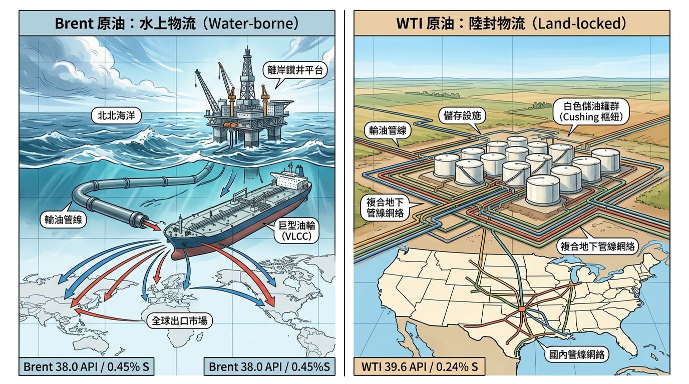
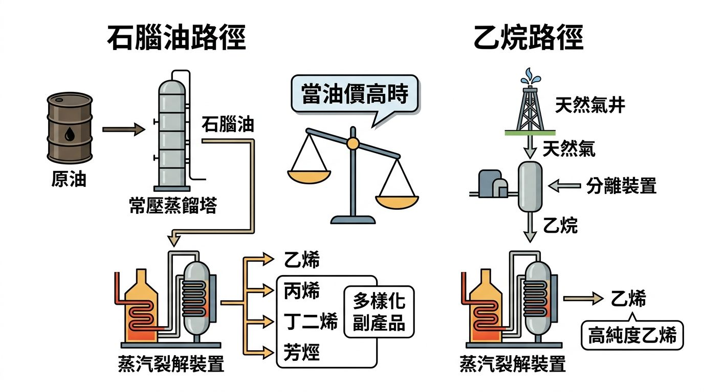
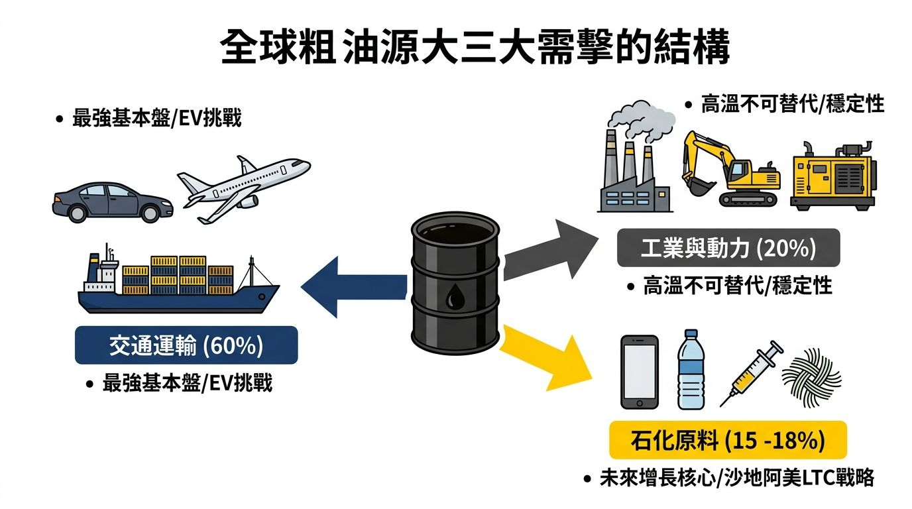
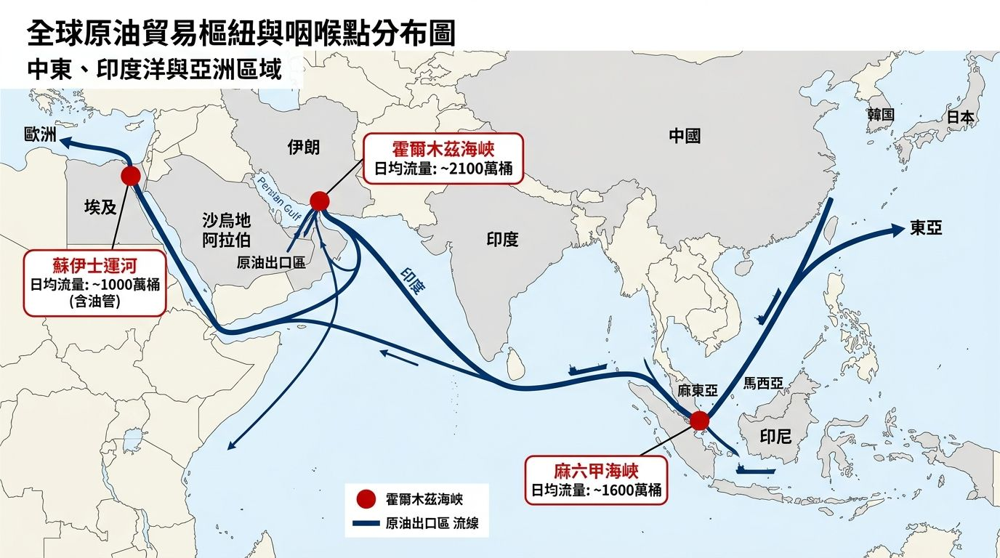
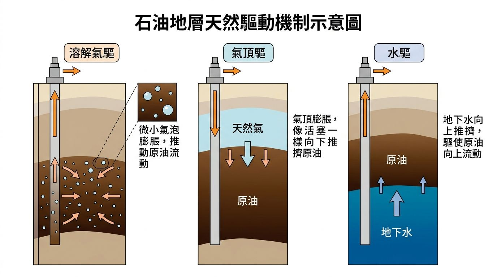
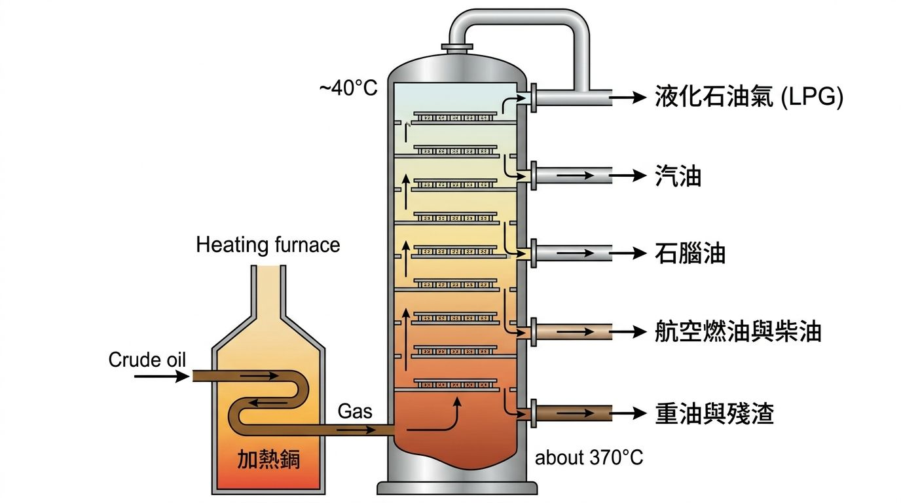

# <摘要> 原油產業全景

- 全球每天消耗約 **1 億桶**原油
- 全球約 **60%** 的石油貿易依賴**海運**
- 在石油圈，每一口試**鑽井** **（Wildcat/Exploratory Well）**都是一筆**數千萬甚至上億美元**的支出
- 有些原油像清水一樣流動相對純淨**（甜原油）**（輕質），有些則像柏油一樣黏稠(**酸原油)**（重質）
- **上游四階段：** 地震勘探（找位置）→ 試鑽（賭運氣）→ 評估（算價值）→ 開發（搞生產）。

---

- 沙地阿美的實際稅率（含 Zakat）高達 **「採購」（49.6%）**與**「政府特許費」（19.5%**）
- 沙地阿美的業務結構中，上游部門對利潤（EBIT）的貢獻佔比長期維持在 **84–88%** 之間。
- 沙地阿美在 FY2023 的營業利潤（EBIT）高達 SAR 868.29B（約 2315 億美元），而到 FY2024 則降至 SAR 774.63B
- 以沙烏地阿拉伯為例，雖然其大部分原油通過波斯灣（經霍爾木茲海峽）出口，但他們建設了一條跨越國土、連接波斯灣與紅海的**「東西向輸油管線」(East-West Pipeline)**

在石油產業鏈中，上游與下游的獲利邏輯通常是**負相關**或**不完全正相關**的：

- **當油價高企（例如 $100/桶）時**：

   - **上游**：暴利。阿美作為低成本生產者，每桶油的利潤極高。
   - **下游**：利潤可能受壓。因為原材料（原油）成本上升，如果終端消費者無法承受高油價（需求破壞），煉油利潤會收窄。
   - **結果**：上游賺的錢遠超下游虧的，集團利潤創新高。

- **當油價低迷（例如 $40/桶）時**：

   - **上游**：利潤縮水。雖然阿美依然盈利（因為其成本僅需幾美元），但相較於高油價時期，現金流會大幅下降。
   - **下游**：利潤往往擴張。極低的原油成本會刺激煉油與化工產品的需求，導致「裂解利差」與「乙烯價差」擴大。
   - **結果**：下游利潤的「爆發式成長」可以彌補上游的部分損失，維持穩定的分紅能力。

### **(下游)**純精煉商

利潤 = 「3-2-1 裂解利差」（3 桶原油產出 2 桶汽油與 1 桶柴油）

### **(下游)**化工股

利潤 = 「乙烯價差」(乙烯價格減去石腦油（Naphtha）價格)

### FY2024 成本清單：誰拿走了第一桶金？

根據看沙地阿美官方披露的 FY2024 合併成本結構，其總運營成本的比例分佈如下：

- **採購（Purchases）：49.6%**
- **特許費及其他稅項（Royalties & Other Taxes）：19.5%**
- **生產及製造（Producing & Manufacturing）：10.7%**
- **折舊及攤銷（D&A）：10.0%**
- **銷售、行政及一般費用（SA&G）：8.7%**
- **勘探費用（Exploration）：0.8%**
- **研發費用（R&D）：0.6%**

### 全球原油成本階梯：誰在裸泳？

由「全球供應成本曲線」（Supply Cost Curve），由低到高排列著全球主要的產油地區

### 1\. 第一梯隊：中東傳統油田（成本：約 3–10 美元/桶）

正如我們在沙地阿美案例中看到的，沙烏地阿拉伯、科威特、伊拉克等地的傳統陸上油田是全球原油的「成本地板」。

### 2\. 第二梯隊：俄羅斯與部分陸上傳統油田（成本：約 15–30 美元/桶）

俄羅斯的油田大多位於西西伯利亞，雖然地質條件也不錯，但由於氣候嚴寒、基礎設施老舊，且運輸距離遙遠，其綜合生產成本高於中東。不過，這在某種程度上抵消了其俄羅斯盧布（Rouble）計價的成本壓力，使其在低油價環境下仍具備極強韌性。

### 3\. 第三梯隊：淺水與成熟海域（成本：約 20–40 美元/桶）

例如英國與挪威的北海油田（North Sea）。這些地區開發歷史悠久，雖然技術成熟，但由於油田進入衰退期，需要更多的維護費用和強化採油技術（EOR），加上離岸作業的高昂物流成本，使其成本結構來到中間位置。

### 4\. 第四梯隊：美國頁岩油（成本：約 40–60 美元/桶）

這是過去十年全球能源市場最大的變數。頁岩油商利用水平鑽井與水力壓裂技術，在原本無法開採的岩層中「榨」出石油。雖然技術進步神速，但頁岩油井的產量衰減極快，且需要大量密集的資本投入，這使得其「完全成本」（Full-cycle Cost）遠高於傳統油田。

### 5\. 第五梯隊：深海、油砂與超重油（成本：約 60 美元以上/桶）

例如加拿大的油砂（Oil Sands）或巴西的超深水油田。這些項目通常需要天文數字的初期投資，且生產過程複雜（例如油砂需要大量熱能加熱才能流動）。這些產區通常是市場上的「高成本邊際供應」，在油價低迷時最容易受傷。

### 邊際生產者：決定價格的那桶油

在經濟學中，有一個非常重要的概念：在競爭市場中，商品的價格通常由「滿足需求的最後一單位供應成本」決定。在原油市場，這個角色被稱為**邊際生產者（Marginal Producer）**。

### 為什麼油價不會長期低於頁岩油成本？

想像全球每天需要 1 億桶石油。

- 如果沙烏地和俄羅斯加起來只能提供 4,000 萬桶（成本 10–20 美元）。
- 如果其他傳統地區提供 3,000 萬桶（成本 30 美元）。
- 剩下的 3,000 萬桶必須由美國頁岩油來補足（成本 50 美元）。

這意味著，如果市場要得到這最後的 3,000 萬桶，油價就必須維持在 50 美元以上，否則頁岩油商會停止鑽探，導致供應不足。一旦供應不足，油價就會反彈。

**當前全球原油市場的邊際生產者，很大程度上就是美國的頁岩油商。** 這也是為什麼 50–60 美元經常被視為原油價格的一個「心理支撐區」或「價值中樞」——因為低於這個價格，全球約 10% 的供應（美國頁岩油）就會面臨生存危機，最終引發供應緊縮。

---

| 咽喉點 | 日均流量 (bpd) | 替代可能性 | 主要地緣風險 | 
|---|---|---|---|
| **霍爾木茲海峽** | 約 2,100 萬 | **極低** (管線容量嚴重不足) | 區域戰爭、主權國家封鎖 | 
| **麻六甲海峽** | 約 1,600 萬 | **中** (可繞行印尼其他海峽) | 海盜、航道擁擠、大國封鎖 | 
| **蘇伊士運河** | 約 500 - 700 萬 | **高** (可繞行好望角，僅成本增加) | 事故封鎖、區域衝突 (紅海) | 

### 天然驅動：地層壓力的「第一桶金」

### 「**人工舉升（Artificial Lift）**」階段

### 1\. 抽油泵（Sucker Rod Pump）

這就是你在德州電影中常見的「**磕頭機**」。

- **運作邏輯**：地面上的馬達帶動長長的連桿（抽油桿），像活塞一樣在井底上下抽動，把油「舀」上來。

- **優點**：結構簡單、極其耐用、維修便宜。
- **缺點**：不適合極深的井，且產量上限較低。

### 2\. 氣舉（Gas Lift）

- **運作邏輯**：將壓縮後的天然氣從井口注入到井筒底部。這些氣體混入原油中，降低了原油的總體密度（讓油變得像泡沫一樣輕）。因為變輕了，原本不足的地層壓力就能輕鬆地把油推向地面。
- **投資視角**：這需要周邊有成熟的天然氣管網，通常用於中等產量的油田。

### 3\. 電潛泵（Electric Submersible Pump, ESP）

- **運作邏輯**：直接把一個巨大的多級離心泵沉入井底幾千公尺處，由電力驅動，像抽水機一樣直接把油噴上來。
- **優點**：力量極大，適合高產量、高含水、極深的油井。
- **缺點**：**非常貴**，而且耗電量驚人。如果井底溫度過高或有砂石，ESP 很容易壞掉，更換一次的成本（加上停產損失）可能高達數十萬美元。

### 「第三次採油」- 強化採油 (EOR)：榨乾每一滴殘餘價值

### 1\. 注水與注氣（次級採油與 EOR 的過渡）

最常見的做法是在油田周圍鑽「注水井」，把大量經過處理的水壓入地底，把石油往生產井的方向「趕」。這能維持地層壓力。

### 2\. 熱力採油（Thermal Recovery）

主要用於「重油」。重油像瀝青一樣黏稠，根本流不動。我們透過注入高溫蒸汽，加熱地層，讓原油變稀、像糖漿一樣流出來。

- **案例**：加拿大油砂田（Oil Sands）大量使用這種技術。

### 3\. 化學與二氧化碳注入（Chemical / CO2 Injection）

- **CO2 驅油**：將二氧化碳注入地層。二氧化碳極易溶解於原油，能讓原油體積膨脹並降低黏度，效果極佳。

- **投資關聯**：現在許多石油公司推行 **CCUS（碳捕捉、利用與封存）**，將工廠排放的二氧化碳捕獲後注入油田，既能減碳又能增產。這已成為沙地阿美等大型 NOC 轉型 ESG 的核心策略。

---

### 蒸餾塔的運作結構

想像一個高達 50 公尺以上的巨型金屬塔，這就是蒸餾塔。

1. **預熱與汽化**：原油首先經過一個巨大的加熱爐，溫度被加熱到約 350°C 到 400°C。此時，大部分的原油都變成了蒸汽。

2. **進入蒸餾塔**：這些熱氣從塔底噴入。塔內是一層一層的「塔盤」（Trays），每層塔盤都有許多小孔，讓蒸汽向上飄。

3. **分層冷凝**：塔底最熱，塔頂最涼。

   - 沸點較高的重分子，升不上幾層就會因為溫度降低而冷凝變成液體，留在下方的塔盤。

   - 沸點較低的輕分子，可以一路衝到塔頂才凝結。

1. **側線採出**：工程師在塔的不同高度開孔，把凝結在該層的液體抽出來。這些被抽出來的液體，就稱為不同的**「餾分」（Fractions）**。
