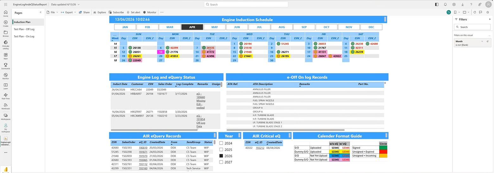
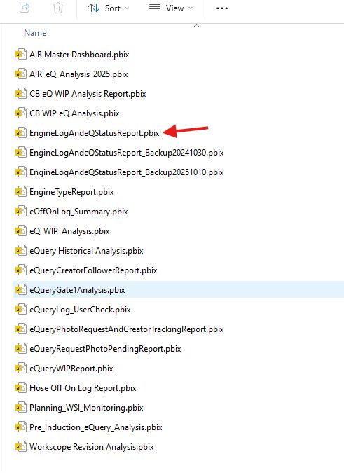

## Case Study - produce some **power BI dashboard** for engine planning including induction WSI outstanding and WSI amendments

### Source of WSI
#### eIM list

#### eIM > History

### Sample of Power BI (OffLog)
Based on the Induction plan, to see if WSI is issued on the status

- Example of OffLog Power BI dashboard from 
	"V:\Customer & Planning\Common\Technical Records\Macro file\PowerBI\EngineLogAndeQStatusReport.pbix"
	

