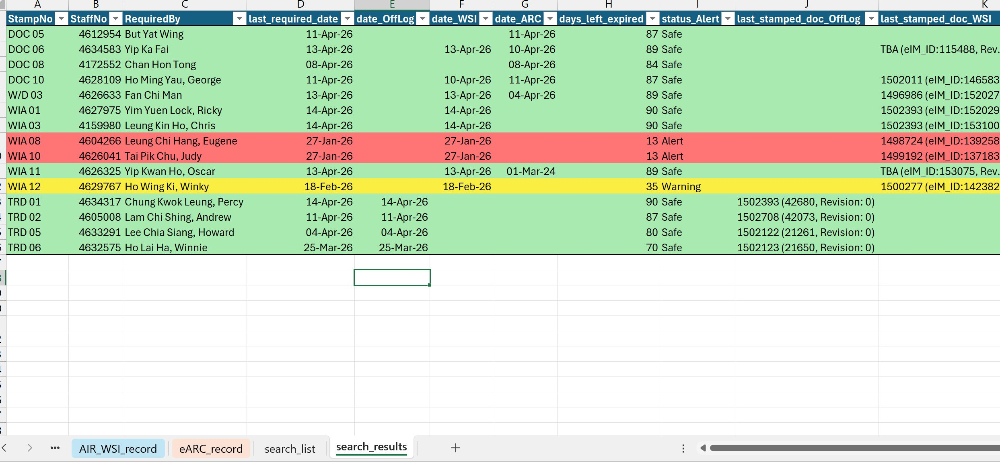

### Workflow
1. extract data from 3 source locations like eARC, OffLog & AIR-WSI
2. find the most current stamp date from different holders
3. list the records based on the holder list
4. send an email to reminder to critical stakeholders like supervisors, assistant managers & head of manager
5. package it all into scheduler tasks via vbScript & batch file

