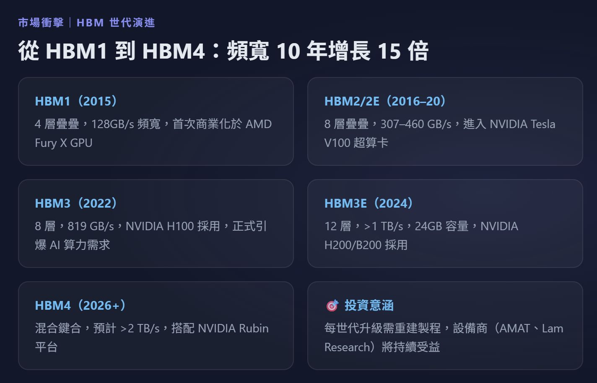

# HBM（高頻寬記憶體）全球分析報告

https://www.perplexity.ai/search/hbm-sheng-chan-she-ji-jing-mi-5pP.r5oQSFW3CJgWiMN85g?preview=1

**報告生成日期：** 2026 年 04 月 06 日  
**數據主要覆蓋期間：** 2024 年 Q1 – 2026 年 Q1

---

## ⚡ 最新動態摘要（近 6 個月重大事件）

> - **2026-03**：Micron 於苗栗縣揭幕全新晶圓廠（原 Powerchip 廠址收購），台灣員工人數預計於 2026 年底擴充至 15,000 人，HBM 產線為主要擴張目標[focustaiwan](https://focustaiwan.tw/business/202603260017)
>     
> 
> - **2026-01**：Samsung 宣布 2026 年 HBM 產能擴增 50%，P4 廠房新增 60,000 片/月 DRAM 產能，並開始量產 HBM4trendforce+1
>     
> 
> - **2025-12**：SK Hynix M15X 廠（青州）提前兩個月於 2026 年 2 月啟動量產，首批月產能約 10,000 片晶圓，用於 HBM4[sedaily](https://en.sedaily.com/finance/2025/12/26/samsung-sk-hynix-to-begin-worlds-first-hbm4-mass-production)
>     
> 
> - **2025-12**：Trump 政府批准 NVIDIA H200 晶片出口中國，採「25% 收入分成」機制，HBM 需求有望新增中國 AI 市場出口渠道wikipedia+1
>     
> 
> - **2025-08**：中國要求美國放寬 HBM 出口管制以換取貿易協議，顯示 HBM 已成地緣政治博弈核心籌碼[reuters](https://www.reuters.com/world/china/china-wants-us-relax-ai-chip-export-controls-trade-deal-ft-reports-2025-08-10/)
>     

---

## 一、主要用途分佈（需求方）

|排序|用途名稱|全球需求佔比|典型應用場景|近期需求趨勢|來源層級|
|---|---|---|---|---|---|
|1|AI/ML 訓練與推理|55%+（2026年）|NVIDIA H200、Blackwell、AMD MI350 等 GPU 加速器；每顆需 4.8–8 TB/s 記憶體頻寬|**強勁成長**：2025 年需求 YoY +130%，2026 年 YoY +70%；ASIC 需求另增 82%|P4 [patsnap](https://www.patsnap.com/resources/blog/articles/hbm-technology-landscape-2026-market-and-ai-demand/)|
|2|高效能運算（HPC）|~25%（2026年）|氣候模擬、生命科學、量子化學計算、政府超算中心|**穩健成長**：隨 AI 超算部署加速，HPC 與 AI 工作負載邊界持續融合|P4 [patsnap](https://www.patsnap.com/resources/blog/articles/hbm-technology-landscape-2026-market-and-ai-demand/)|
|3|繪圖與遊戲（GPU）|~12%（2026年）|旗艦遊戲顯卡（如 NVIDIA RTX 系列）、專業視覺化工作站|**相對萎縮**：HBM 資源被 AI 訂單排擠，遊戲 GPU 轉向 GDDR7，佔比下降|P4 [patsnap](https://www.patsnap.com/resources/blog/articles/hbm-technology-landscape-2026-market-and-ai-demand/)|
|4|新興應用（AV／Edge AI／6G）|~8%（2026年）|自動駕駛感知晶片、邊緣推理模組、6G 基地台 DSP|**快速成長**：自動駕駛、邊緣 AI 加速落地，2027–2028 年佔比預計提升|P4 [patsnap](https://www.patsnap.com/resources/blog/articles/hbm-technology-landscape-2026-market-and-ai-demand/)|

> **結構性趨勢標注**：ASIC（應用專用晶片）需求正在快速追超 GPU 需求。根據 Goldman Sachs 分析，亞馬遜、Google、Meta 等超大規模雲端業者的 ASIC HBM 需求預計 2026 年 YoY 暴增 82%，即將超越傳統 GPU 驅動需求，成為 HBM 市場新主要引擎 。[linkedin](https://www.linkedin.com/posts/raghavendra-anjanappa-ba7a0432_hbm-asics-semiconductors-activity-7353001412772966400-nQfS)

---

## 二、全球產能分佈（供應方）

|排序|公司名稱|全球產能佔比|主要生產地區|具體生產特徵（含近期動態）|來源層級|
|---|---|---|---|---|---|
|1|**SK Hynix**（海力士）|55%（2025年全年）/ 53%（2025年Q3）|韓國清州（M15X）、韓國利川（M14）、韓國龍仁（新廠建設中）|TSV 月產能 150,000 片（2025Q4）；主力產品 HBM3E，市佔率 55%（全球）。**[最新] 2026年Q1**：M15X 首期無塵室提前 2 個月啟動（原計劃 2026-06，實際 2026-02），初期月產 10,000 片 HBM4 晶圓，計劃 2026 年底大幅擴增；龍仁集群（120 兆韓元投資，約 888 億美元）首座廠房預計 2027 年 5 月完工，滿產後每月新增 350,000 片，總月產能屆時達 900,000 片。Goldman Sachs 確認 SK Hynix 在 HBM3/HBM3E 的領先地位至少維持至 2026 年。|P1/P4 news.skhynix+3|
|2|**Samsung**（三星電子）|27%（2025年全年）/ 35%（2025年Q3）|韓國平澤（P1–P4）、韓國華城|主攻 HBM3E 及 HBM4；**[最新] 2025年Q4–2026年Q1**：平澤 P4 產線擴充 60,000 片/月 DRAM 產能（預計 2026 年 Q2 完成）；宣布 2026 全年 HBM 產能擴增 50%，月產能目標提升至 250,000 片（較現行 170,000 片升 47%）；KB 證券預估 2026 年 HBM bit 出貨量 YoY 三倍成長至 112 億 Gb，HBM4 佔約半數。Samsung 在 NVIDIA HBM4 內部測試中獲最高評分，優於競爭對手。**數據衝突說明**：Q2 2025 部分來源顯示市佔 17%，與 Q3 2025 的 35% 差距逾 10 ppt，反映 Samsung HBM 良率改善後快速搶占份額；採 Q3 最新數據。|P4/P3 reuters+3|
|3|**Micron Technology**|21%（2025年Q2）/ 11%（2025年Q3）|台灣台中（主力廠）、台灣苗栗（新廠，2026年Q1揭幕）、日本廣島（1β DRAM）|主要 HBM 生產集中台灣；CEO Sanjay Mehrotra 明確目標 2026 年市佔超過 20%；現行月產能約 20,000 片，計劃擴增至 60,000 片/月（YoY 三倍）。**[最新] 2026年Q1**：收購 Powerchip 苗栗廠址，台灣員工擴至 15,000 人（2026 年底）；2026 年 HBM 產能已售罄。相較 SK Hynix 與 Samsung，Micron 在 CoWoS 後段封裝產能方面受到更大制約，短期市佔承壓。**數據衝突說明**：Q2 21% vs Q3 11%，落差超 10 ppt，原因為 Samsung 良率改善搶佔份額，以及 Micron CoWoS 封裝產能限制；採 Q3 最新數據，並標注趨勢為回升中。|P1/P4 softwareseni+3|

> **注意**：HBM 市場為**全球唯一三方寡頭**（SK Hynix、Samsung、Micron），不存在第四位規模化量產商 。[softwareseni](https://www.softwareseni.com/samsung-sk-hynix-micron-and-the-hyperscalers-who-locked-up-all-the-memory/)

---

## 三、供需驅動因素分析

## 3A. 供應端驅動因素

|排序|驅動因素名稱|影響方向|影響強度|時間維度|具體說明（含 2024 年後事件）|
|---|---|---|---|---|---|
|1|**CoWoS 先進封裝產能瓶頸**|↓（供應受限）|H|短S＋中M|TSV 堆疊後的 HBM 必須搭配 CoWoS（Chip-on-Wafer-on-Substrate）矽中介層才能出貨至 GPU。TSMC 主導全球 CoWoS 產能，2026 年訂單已超額認購，排程被 Apple、NVIDIA、AMD 瓜分，交貨週期 6–9 個月。TSMC 宣布投入約 30 億美元（台幣 900 億）建設專屬先進封裝廠，但產能爬坡需 2–3 年 patsnap+2。|
|2|**HBM4 良率低企限制供給爬坡**|↓（近期供應受限）|H|短S|HBM4 早期量產良率低於 65%，遠低於成熟 HBM3 的 85%+。Samsung 因前期良率問題曾遲滯出貨，SK Hynix 在 HBM3E 良率方面領先。2026 年 HBM4 量產開啟後，良率爬坡速度將成為各廠擴產計劃能否兌現的關鍵變數 eureka.patsnap+1。|
|3|**資本支出週期長，新廠投產時間不可壓縮**|↔（長期利好但短期不解渴）|M|中M＋長L|SK Hynix M15X（超過 200 億美元投資）已提前 2 個月啟動（2026-02），但滿產須至 2027 年中；龍仁集群首廠 2027 年 5 月完工，全面運轉要到 2030 年。Samsung P4 擴線、Micron 苗栗新廠亦面臨相同建設週期限制，短期供給彈性極低 sedaily+1。|
|4|**HBM 生產擠出傳統 DRAM 產能**|↓（對 DRAM 市場）／↑（HBM 自身溢價）|M|短S＋中M|HBM 轉換需佔用高比例 DRAM 晶圓產線，導致 DDR5、LPDDR5 等一般記憶體產能被壓縮，形成「雙重供應緊張」格局。2025 年 SK Hynix 因 HBM 擴張首度超越 Samsung 成為全球 DRAM 市場佔有率第一 marklapedus.substack+1。|
|5|**地緣政治與出口管制風險**|↓（不確定性）|M|短S＋中M|美國商務部 BIS 持續審視 HBM 對中國的出口管制。2025 年 12 月 Trump 批准 H200 對「核准買家」出口但要求 25% 收入分成；2026 年 1 月 BIS 正式化彈性審查政策。此政策路徑仍具高度不確定性，可能影響供應商收入結構與市場分配策略 wikipedia+1。|

## 3B. 需求端驅動因素

|排序|驅動因素名稱|影響方向|影響強度|時間維度|具體說明（含 2025 年後事件）|
|---|---|---|---|---|---|
|1|**AI GPU 算力基建持續擴張**|↑|H|短S＋中M|NVIDIA Blackwell 架構採用 192 GB HBM3E；下一代 Rubin 架構已對接 HBM4（2026 年量產）。根據 JEDEC 數據分析，2025 年 HBM 需求 YoY +130%，2026 年 YoY +70%。全球超大規模數據中心資本支出持續創新高，帶動 HBM 全面sold-out patsnap+1。|
|2|**超大規模業者 ASIC 訂製晶片需求爆發**|↑|H|短S＋中M|Amazon（Trainium）、Google（TPU）、Meta 等雲端巨頭加速自研 AI 晶片，ASIC 晶片從 LPDDR/GDDR 遷移至 HBM，2026 年 ASIC 端 HBM 需求預計 YoY +82%，即將超越 GPU 驅動需求成為最大增量來源（Goldman Sachs，2025 年分析）[linkedin](https://www.linkedin.com/posts/raghavendra-anjanappa-ba7a0432_hbm-asics-semiconductors-activity-7353001412772966400-nQfS)。|
|3|**AI 記憶體超循環（Memory Supercycle）結構性支撐**|↑|H|中M＋長L|HBM 市場規模從 2024 年的 29.3 億美元預計成長至 2033 年的 167.2 億美元（CAGR 21.35%）；2025 年 TAM 約 35 億美元，2028 年目標 1,000 億美元（CAGR ~40%）。此超循環由生成式 AI、LLM 規模化、多模態模型三重結構需求驅動，並非單一周期性波動 patsnap+1。|
|4|**中國 AI 市場部分開放（出口政策鬆綁）**|↑（增量需求）|M|短S|2025 年 12 月 Trump 政府批准 H200 出口中國（25% 收入分成機制），中國 AI 大廠（如百度、阿里、騰訊）有望重新採購高階 GPU+HBM 解決方案，為 SK Hynix、Micron 帶來額外中國市場訂單機會。但政策路徑仍不穩定，2026 年 1 月 BIS 正式化審查機制 wikipedia+1。|
|5|**HBM 規格加速迭代推動換機週期**|↑|M|中M|HBM4（第六代）2026 年量產，提供遠高於 HBM3E 的頻寬密度與能效，推動 AI 加速器客戶強制升級採購。HBM4E（採用 1c DRAM）已由 SK Hynix 納入 M15X 產線規劃，預計 2027–2028 年推出，形成持續換機需求 sedaily+1。|

## 3C. 供需平衡展望摘要

> 綜合以上驅動因素，預期 HBM 在 **2026–2027 年短中期**內持續呈現 **供需極度緊張** 態勢。  
> 三大供應商（SK Hynix、Samsung、Micron）2026 年全年產能已悉數售罄，任何良率下滑或封裝瓶頸惡化均將進一步加劇緊張格局 。introl+1  
> 主要供應端風險來自 **CoWoS 封裝產能瓶頸**（TSMC 在台灣的集中度造成單點失效風險）及 **HBM4 量產良率不確定性**。  
> 主要需求端風險來自 **AI GPU 基建投資持續加速** 及 **ASIC 訂單爆發超預期**，可能使市場供給更形短缺。  
> 關鍵監測指標包含：① SK Hynix M15X 月產能爬坡進度（2026 年底目標量）、② Samsung HBM4 NVIDIA 認證進度、③ TSMC CoWoS 新廠 2027 年投產時程 。patsnap+2

---

## 補充說明

**資料來源清單：**

|來源層級|資料來源名稱|數據截止日期|涵蓋範圍|
|---|---|---|---|
|P1|SK Hynix 官方新聞稿 2026 市場展望|2026年Q1|SK Hynix 產能、市佔、HBM4 擴廠計劃 [news.skhynix](https://news.skhynix.com/2026-market-outlook-focus-on-the-hbm-led-memory-supercycle/)|
|P3|Counterpoint Research（路透引用）|2025年Q3|三方市佔率最新分配 [reuters](https://www.reuters.com/world/asia-pacific/samsung-electronics-highlights-progress-hbm4-chip-supply-2026-01-02/)|
|P3|TrendForce HBM Industry Analysis 4Q25|2025年Q4|三廠產能比較、HBM4 進度 [trendforce](https://www.trendforce.com/research/download/RP251029MY)|
|P3|PatSnap HBM Technology Landscape 2026|2026年Q1|應用需求分佈、市場規模預測 [patsnap](https://www.patsnap.com/resources/blog/articles/hbm-technology-landscape-2026-market-and-ai-demand/)|
|P4|Korea JoongAng Daily / Chosun Ilbo|2026年Q1|Samsung 擴產計劃、市佔預測 koreajoongangdaily.joins+1|
|P4|Reuters / FT|2025–2026年|出口管制政策、Samsung HBM4 進展 reuters+1|
|P4|Patsnap Chiplet / PwC Semiconductor Report|2026年Q1|CoWoS 封裝瓶頸分析 patsnap+1|
|P4|Focus Taiwan / Micron 官方聲明|2026年Q1|Micron 苗栗新廠、台灣擴產 [focustaiwan](https://focustaiwan.tw/business/202603260017)|
|P4|FDD Policy Brief / BIS 規章|2025年12月–2026年1月|美國出口管制政策 wikipedia+1|

---

**數據缺口清單（⚠️）：**

|缺口項目|最新可用數據年份|缺口原因|建議補充方式|
|---|---|---|---|
|Micron 2026 年實際 HBM 市佔率|2025年Q3（11%）|Micron 苗栗新廠剛於 2026-03 揭幕，產量尚未計入最新報告|追蹤 Micron FY2026 Q2 財報（預計 2026 年 4 月發布）|
|Samsung HBM4 良率具體數值|2026年Q1（估計值）|Samsung 未公開披露 HBM4 良率，僅有業界推估與 NVIDIA 測試通過消息|關注 Samsung DS 部門 2026 年 Q1 法說會細節|
|全球 HBM 應用需求佔比精確分解|2026年（估算）|無法取得 TrendForce 或 IDC 付費報告中的精確行業分解數據|採購 TrendForce HBM 1Q26 完整版報告或 IDC Memory Tracker|
|中國本土 HBM 替代進展（如長鑫存儲 CXMT）|⚠️ 2024年（資料有限）|CXMT 技術進度高度不透明，缺乏可靠第三方驗證數據|關注 SEMI China 報告與 TechInsights 晶片拆解分析|

**備註：**

1. SK Hynix 市佔數字存在來源差異（Q2 2025：62% vs Q3 2025：53% vs 2025全年：55%），主要反映 Samsung HBM3E 良率在 H2 2025 顯著改善後的快速市佔回升；本報告以最新 Q3 2025 Counterpoint 數據為主，並附年度均值作參考 。reuters+1
    

2. Micron 的 Q2 2025（21%）與 Q3 2025（11%）差距亦超過 10 ppt，判斷原因為 Samsung 搶佔份額效應，而非 Micron 實際產量萎縮；Micron CEO 2025 年底仍重申 2026 年市佔目標超過 20% 。[intelligent-stock](https://www.intelligent-stock.com/en/newsshow_53.html)
    

3. 本報告不含中國本土 HBM 廠商（如長鑫存儲 CXMT）的分析，原因為其至今尚無規模化 HBM 量產紀錄，暫不構成全球供應側影響力。